<div align="center">


<a href="https://git.io/typing-svg">
  
</a>

<br/>

[](https://bycu-careers.vercel.app/?student=087_eltwct7VWBBiLffFLFFz)
[](https://linkedin.com/in/martin-thomas)
[](https://github.com/martin8281)


</div>


## 👋 About Me

I'm an **M.Sc. Artificial Intelligence & Cyber Security** student at **CHRIST (Deemed to be University), Bengaluru**, exploring the intersection of **cybersecurity, AI, digital forensics, and security research**.

I build projects to understand how systems work, how they can be secured, and how AI can make security analysis smarter.

> 💡 *I enjoy turning academic concepts into practical projects that solve real-world security problems.*

<table>
<tr>
<td width="50%" valign="top">

**🔐 Security Focus**
- Vulnerability Assessment & Pen Testing (VAPT)
- Web & Network Security
- Digital Forensics
- Security Monitoring & Log Analysis
- Password Security & Exposure Analysis

</td>
<td width="50%" valign="top">

**🤖 AI & Research Focus**
- AI for Cybersecurity & Threat Detection
- LLM Security & AI Red Teaming
- Shadow AI Governance
- Security Automation
- Data-driven Cybersecurity

</td>
</tr>
</table>


## 🛠️ Tech Stack

<div align="center">

**Languages & Frameworks**


**Tools & Platforms**


</div>

| Area | Tools & Skills |
|------|----------------|
| 🔐 **Cybersecurity** | Nmap · Wireshark · Burp Suite · Digital Forensics · VAPT · Network Security |
| 🤖 **AI & Data** | Machine Learning · LLMs · Ollama · Data Analysis |
| 📊 **Visualization** | Dash · Plotly |


## 💼 Portfolio

<div align="center">

**My CHRIST University Placements 2025-26 profile (MSc AI & Cybersecurity)**

[](https://bycu-careers.vercel.app/?student=087_eltwct7VWBBiLffFLFFz)

</div>


## 🚀 Featured Projects

<div align="center">

<!-- TODO: replace each link below with the real repo URL, e.g. https://github.com/martin8281/your-repo -->
<a href="https://github.com/martin8281?tab=repositories"></a>
<a href="https://github.com/martin8281?tab=repositories"></a>

<a href="https://github.com/martin8281?tab=repositories"></a>
<a href="https://github.com/martin8281?tab=repositories"></a>

<a href="https://github.com/martin8281?tab=repositories"></a>
<a href="https://github.com/martin8281?tab=repositories"></a>

<sub>⚠️ LexiPass and the SSH Auth Assessment Tool are for **authorized testing and educational use only**. Use them only on systems you own or have written permission to test.</sub>

</div>


## 📚 Experience

```text
2026 ─┐
      │  🎨  Media Head · S.H.I.E.L.D. Cyber Security & AI Club
      │      Leading media and communication for a student community focused
      │      on cybersecurity and emerging technologies.
      │
      │  🛡️  Cyber Forensics Intern · Cyber Cell, Idukki Police
      │      Hands-on exposure to cybercrime investigation, digital evidence,
      │      and forensic processes.
      │
      │  🔬  Research Intern · Indian Institute of Science (IISc), Bengaluru
      │      One Health initiative: analytical dashboard, AI chatbot integration,
      │      data processing, and scalable research-support solutions.
      ▼
```


## 📈 GitHub Stats

<div align="center">





</div>


## 🔭 Currently

- 🔬 Exploring **LLM security** and **AI red teaming**
- 🛠️ Building tools for **security automation** and **threat detection**
- 🌱 Learning more about **digital forensics** workflows
- 🤝 Open to collaborations, research, hackathons, and internships


## 🌱 Beyond Code

<div align="center">


<br/>

**Currently learning. Constantly building. Always curious.**

<br/>

[](https://bycu-careers.vercel.app/?student=087_eltwct7VWBBiLffFLFFz)
[](https://linkedin.com/in/martin-thomas)
[](https://github.com/martin8281)

⭐ *Feel free to explore my repositories and projects.*


</div>
